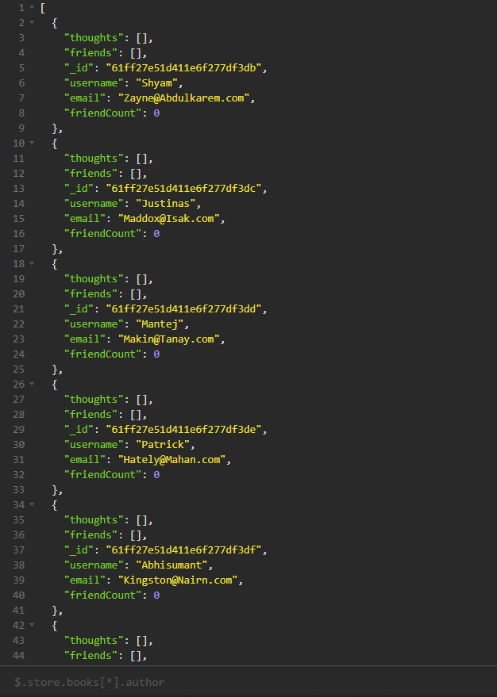

# Social Network API

## Description

This repo will have code that handles the backend of a social media site. This includes the ability to add users, friends, thoughts, and reactions to to thoughts
<br/>


## Installation

- This application requires node.js. 
- Open the server.js file in your terminal and run ```npm i```. This will install all the dependencies needed to run this application.

## Usage

- Start your server by using ```node server.js``` in the terminal
- You would then switch over to insomnia to test each route. Routes provided will account for GET, POST, PATCH, and DELETE

* The included file to seed the database is accessible in root and can be run with ```node  util/seed```

## Demonstration Video

[Click here for a demo!](https://drive.google.com/file/d/14bg6NR2vI3dtfbR-vfehTYRnD7YHNSgO/view?usp=sharing)
<br/>


## Questions

*Find me on GitHub* [@JonkHunkle](https://github.com/JonkHunkle)
